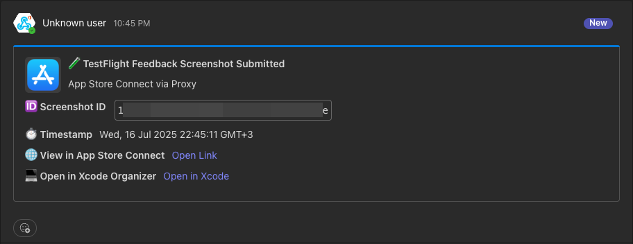
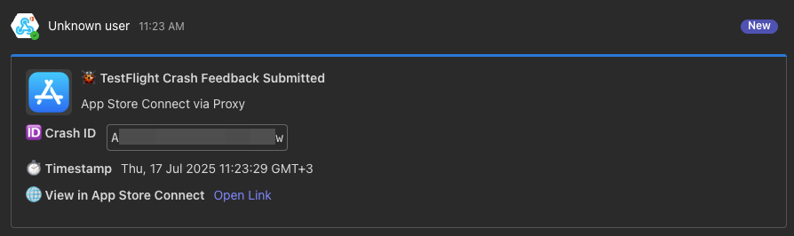
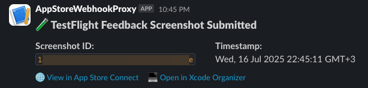
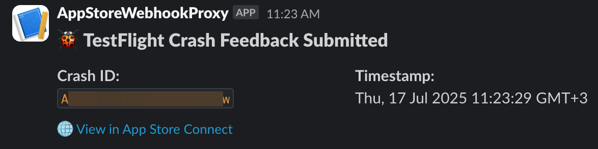

# App Store Webhook Proxy for Microsoft Teams & Slack

[](https://opensource.org/licenses/MIT)


[](https://hub.docker.com/r/yannisalexiou/appstore-webhook-proxy)
[](https://render.com/deploy)
[](https://forums.unraid.net/topic/191280-support-yannisalexiou-app-store-webhook-proxy/)


[](https://coff.ee/alexiou)

This project provides a simple, secure Node.js proxy to forward webhook events from **App Store Connect** to **Microsoft Teams** and/or **Slack**, including signature verification and platform-specific formatting.
---

## 🚀 Features

- ✅ Verifies App Store webhook signatures using HMAC SHA-256
- ✅ Forwards formatted messages to Microsoft Teams and Slack
- ✅ Custom message templates per platform
- ✅ Supports custom timezones for event timestamps
- ✅ Error handling and logging
- ✅ Dockerized and ready for deployment (e.g. Render, Railway)
- ✅ One-click deployable to Render

---

## 📋 Prerequisites
1. App Store Connect access with one of the following roles: **Account Holder**, **Admin**, or **App Manager** to create a webhook.
2. A configured workspace in either: Microsoft Teams and/or Slack

---

## 📦 Installation Guides
End-to-end simple installation guides, from installing the proxy to get the test message to MS Teams / Slack.

> 💡 To enable full support for TestFlight feedback (including deep links to App Store Connect and Xcode Organizer), make sure to set the following environment variables: `APP_ADAM_ID`, `APP_BUNDLE_ID`, and `APP_PLATFORM_ID`.

### 💬 Microsoft Teams


**📘 Step-by-step setup guide**: [Integrate App Store Webhooks with Microsoft Teams (Medium)](https://medium.com/p/af3c8c840c15)




### 💬 Slack


**📘 Step-by-step setup guide**: [Integrate App Store Webhooks with Slack (Medium)](https://medium.com/p/4785b8306c81)




---

## ✅ Supported Webhook Events
- `appStoreVersionAppVersionStateUpdated`
- `webhookPingCreated`
- `betaFeedbackScreenshotSubmissionCreated`
- `betaFeedbackCrashSubmissionCreated`
- `buildUploadStateUpdated`
- `buildBetaDetailExternalBuildStateUpdated`

Unknown events will still be delivered in raw JSON.

---

## 🔧 Proxy Setup Options
Here you can find all the available options to run the proxy.

⚠️ To make the proxy work, it must be accessible from the internet. In my Unraid setup, I use an NGINX reverse proxy. If you're not familiar with this, it's easier to use the [1. One-Click Render Deployment](#1-one-click-render-deployment) option, which provides a public domain automatically.

**The incoming webhook should be sent to the path: `/appstore-webhook`.**

### 1. One-Click Render Deployment
Click below to deploy instantly to Render:

[](https://render.com/deploy)

Make sure to set the environment variables during setup [(Read the Environment Variables table below)](#%EF%B8%8F-environment-variables).
> Render automatically sets `NODE_ENV=production`

### 2. Unraid Setup
To install via Unraid:

1. Open the **Apps** tab in your Unraid dashboard.
2. Search for:  
   **`AppStore-Webhook-Proxy`**
3. Click **Install** and configure the required environment variables.

💬 **Need help or want to leave feedback?**  
Join the support thread in the [Unraid Community Forum](https://forums.unraid.net/topic/191280-support-yannisalexiou-app-store-webhook-proxy/).

🎥 **Watch the setup walkthrough:**  
[](https://www.youtube.com/watch?v=g_EBC1CdblE)

### 3. Docker Setup
Build and run using Docker:

```bash
docker build -t appstore-webhook-proxy .
docker run -p 3000:3000 --env-file .env appstore-webhook-proxy
```

### 4. Manual Setup (Node.js)
If you'd like to run the app directly with Node.js:

```bash
git clone https://github.com/yourusername/appstore-webhook-proxy.git
cd appstore-webhook-proxy
npm install
```

---

## ⚙️ Environment Variables

Create a `.env` file (or set variables directly in your cloud environment):

| Variable            | Explanation                                                                                                                                                                                                 | Default Value |
|---------------------|-------------------------------------------------------------------------------------------------------------------------------------------------------------------------------------------------------------|---------------|
| `SHARED_SECRET`     | **Required.** Secret used to verify incoming App Store Webhook requests. You define it when creating the webhook in App Store Connect, then set the same value here.<br>Set it here: [App Store Webhooks Setup](https://appstoreconnect.apple.com/access/integrations/webhooks) | *(empty)*     |
| `TEAMS_WEBHOOK_URL` | **Required if integrating with Microsoft Teams.** Webhook URL for sending notifications to Microsoft Teams. Leave empty if not used.<br>Example: `https://your-teams.webhook.url`<br>Create it here: [Microsoft Teams Incoming Webhook Guide](https://learn.microsoft.com/en-us/microsoftteams/platform/webhooks-and-connectors/how-to/add-incoming-webhook?tabs=newteams%2Cdotnet) | *(empty)*     |
| `SLACK_WEBHOOK_URL` | **Required if integrating with Slack.** Webhook URL for sending notifications to Slack. Leave empty if not used.<br>Example: `https://hooks.slack.com/services/XXX/YYY/ZZZ`<br>Create it here: [Slack Webhook Guide](https://api.slack.com/messaging/webhooks) | *(empty)*     |
| `APP_STORE_URL`     | *(Optional)* Public URL of your app on the App Store. Included in notifications to make it easier to access the app’s page.<br>Example: `https://apps.apple.com/app/id123456789` | *(empty)*     |
| `TIMEZONE`          | *(Optional)* Timezone used to format timestamps in messages. Use a valid [IANA timezone](https://en.wikipedia.org/wiki/List_of_tz_database_time_zones), e.g. `Europe/Athens`. | `UTC`         |
| `APP_ADAM_ID`        | *(Optional – Used for TestFlight feedback).* The App Store Connect "adamId" of your app. Required to generate links to App Store Connect and Xcode Organizer in TestFlight screenshot feedback messages. | *(empty)*     |
| `APP_BUNDLE_ID`      | *(Optional – Used for TestFlight feedback).* The bundle identifier of your app (e.g. `com.company.app`). Required to generate Xcode Organizer links for TestFlight screenshot feedback. | *(empty)*     |
| `APP_PLATFORM_ID`    | *(Optional – Used for TestFlight feedback).* The App Store Connect platform ID (e.g. `iOS`). Required to generate Xcode Organizer links for TestFlight screenshot feedback. | *(empty)*     |
| `ENABLE_TEST_ENDPOINT` | *(Optional – For local testing only).* When set to `true`, enables the internal `/test/webhook` route that allows you to manually POST Apple-style webhook payloads to simulate real events. This endpoint is disabled by default and should **never be enabled in production**.                                                                                                                                        | `false`       |
| `INTERNAL_TEST_TOKEN`  | *(Optional – Recommended when testing).* Security token required via the `x-internal-token` HTTP header when calling `/test/webhook`. Helps prevent unauthorized access to the test endpoint. Ignored if `ENABLE_TEST_ENDPOINT` is `false`.                                                                                                                                                                              | *(empty)*     |


You can also copy from the example:
```bash
cp .env.example .env
```

---

## 🧪 Running Locally

```bash
npm start
```
Then send a webhook POST to:
```
http://localhost:3000/appstore-webhook
```

---

## 🔐 Usefull App Store Connect info:
- When setting up the webhook in App Store Connect, Apple will ask for a **secret**. Use a string of your choice and set it in `SHARED_SECRET`.
- Official docs:
  - [Apple Webhook Notification Overview]()https://developer.apple.com/documentation/AppStoreConnectAPI/webhook-notifications
  - [Configuring Webhook Notifications](https://developer.apple.com/documentation/appstoreconnectapi/configuring-webhook-notifications)
  - [Webhook Permissions Guide](https://developer.apple.com/help/app-store-connect/manage-your-team/manage-webhooks)


---

## 📂 Project Structure

```
.
├── app.js                 # Entry point
├── routes/
│   └── webhook.js         # Webhook handler
├── utils/
│   ├── eventTemplates.js  # Teams formatter
│   ├── slackTemplates.js  # Slack formatter
│   └── stateDescriptions.js
├── services/
│   ├── signatureVerifier.js
│   ├── teamsNotifier.js
│   └── slackNotifier.js
├── middleware/
│   ├── errorHandler.js
│   └── logging.js
├── Dockerfile
├── render.yaml            # Render deploy spec
├── .env.example
├── .dockerignore
├── .gitignore
└── README.md
```

---

## 💡 Contributing

PRs and feedback welcome! You can help with:
- More supported event types
- Custom Slack/Teams formatting
- Delivery logs and retry support

### 🧪 Testing Locally

When developing or validating new webhook event types, you can simulate Apple webhook deliveries using the internal **test endpoint**.

#### 1. Enable the test endpoint

In your local `.env` file, add:

```bash
ENABLE_TEST_ENDPOINT=true
INTERNAL_TEST_TOKEN=super_secret_token
```

⚠️ Important:
Never enable this in production environments.
The /test/webhook route is only intended for local or QA testing.


#### 2. Send a test payload
```
curl -X POST http://localhost:3000/test/webhook \
  -H "Content-Type: application/json" \
  -H "x-internal-token: super-secret-token" \
  -d '{
    "data": {
      "type": "buildUploadStateUpdated",
      "id": "1239d9f7-12b5-4456-8859-12b04e6e8445",
      "version": 1,
      "attributes": { "oldState": "PROCESSING", "newState": "COMPLETE" },
      "relationships": {
        "instance": {
          "data": { "type": "buildUploads", "id": "1239d9f7-12b5-4456-8859-12b04e6e8445" },
          "links": { "self": "https://api.appstoreconnect.apple.com/v1/buildUploads/1239d9f7-12b5-4456-8859-12b04e6e8445" }
        }
      }
    }
  }'
```

#### 4, Verify output

If configured correctly:
- You’ll see messages in Slack and/or Microsoft Teams.
- The terminal will log something like: `🧪 Simulating Apple event: buildUploadStateUpdated`
- The HTTP response will confirm what was sent:
```
{
    "ok": true,
    "receivedType": "buildUploadStateUpdated",
    "results": {
        "slack": "sent",
        "teams": "sent"
    }
}
```

#### 5. Disable after testing
Remove or comment out these lines in .env when done:
```
# ENABLE_TEST_ENDPOINT=true
# INTERNAL_TEST_TOKEN=super-secret-token
```
This ensures the testing route is not exposed in production deployments.

---

## 📝 License
MIT
